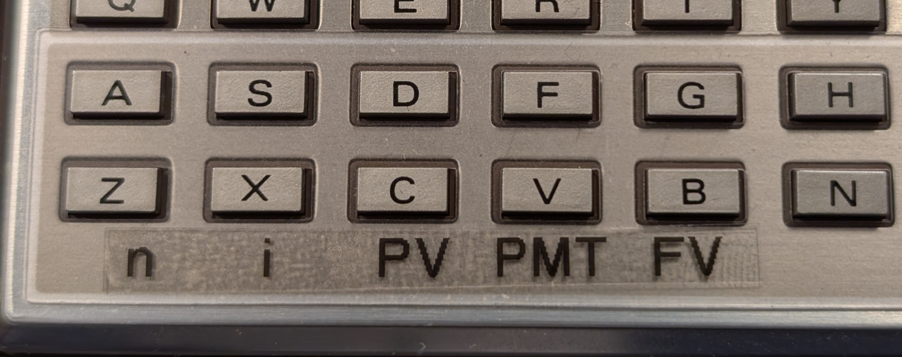
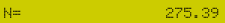
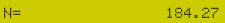

# ANNUITY

A set of **`PC-1211`** programs to calculate annuities like mortgage payments.
These programs are inspired by the annuity functionality of the
legendary HP-12c financial calculator.

## Preparation

With the **`PC-1211`** connected to the PC sound card via a
**`CE-121`** or **`CE-122`** interface execute the following commands
in **`PRO`** mode:

<br/>


On the PC execute the command

```
cstore -i pc1211-ANNUITY.bas pc1211 load
```

After the load is complete change into **`DEF`** mode since the
following examples are all based on that setting to invoke the
individual programs.

## Reservable Keys Overlay

The **ANNUITY** programs make use of the **`DEF`** entry points for keys
`Z`, `X`, `C`, `V` and `B`. These as well as the underlying variables are
used as shown in this keyboard overlay:



This means that key **`Z`** as well as the `Z` variable are associated
with the value for `n`, which is the number of payment periods. Likewise
key **`X`** and variable `X` are associated with `i` for the interest
rate per period. The same pattern goes for `PV` (Present Value),
`PMT` (Payment) and `FV` (Future Value).

## Example Mortgage

Our example is based on a theoretical mortgage of

* $250,000 loan amount
* 5.5% fixed interest per year
* 30 years monthly payments
* monthly compounding interest

These are fairly standard fixed interest mortgage terms.

### Base Input And Calculating PMT

From the above mortgage definition we know

* `n` - the number of pay periods (30x12=360)
* `i` - the interest rate per period (5.5/12=0.458333)
* `PV` - the Present Value ($250,000)
* `FW` - the Future Value ($0 - paid off)

What we want to calculate now is `PMT`, the monthly payment. To do so we
start the first program via **`RUN`** or **`SHIFT-A`**. The following
dialog will happen:

| Prompt | Input | Comment |
| ------ | ----- | ------- |
|  |  | Convert years to months |
|  |  | Convert APR to months |
|  |  | Original loan amount |
|  | | No Input |
|  |  | Zero is Paid Off |

To calculate the monthly payment for this mortgage we now press
**`SHIFT-V`**, the **`DEF`** entry point for `PMT` calculation. Shortly after
the display should show


This is the monthly payment for the above mortgage without any
escrow.

## Changing The Monthly Payment

All mortgage lenders these days allow to make extra monthly payments
for principal. Many of them let you change this at any time in their
online portal. Let us see what would happen if we increased the monthly
payment from $1,419.47 to $1,600.

Most of the relevant data is still in all the associated variables. If
you check the content then the following should be present:

* `Z` = 360 (`n` months)
* `X` = 0.458333 (`i` 5.5% / 12)
* `C` = 250000 (`PV` - the original loan amount)
* `V` = 1419.47 (`PMT` - monthly payment)
* `B` = 0 (`FV` - debt after 360 months - AKA paid off)

We can therefore change the monthly payment to $1,600 by entering


Note that **`V`** is labeled **`PMT`** for Payment on our keyboard overlay.

How does this affect our mortgage? The interest rate doesn't change. The
current balance doesn't change. The only thing changing is the speed at
which the mortgage is being paid off. So what we want to know is how sooner
we are going to be debt free.

To do so we run the program for **`n`** by pressing **SHIFT Z**.
It will prompt for an 
[Approximation](#approximation) of N (see below).
If not sure, just hit **ENTER** and be patient. There will be two results
shown via **`PRINT`** that require hitting **ENTER**:

| Display | Comment |
| ------- | ------- |
|  | Months remaining |
|  | Years remaining |

This means that paying $200 extra every month shaves off about
**85** months or **7** years.

## Making An Extra One-Time Payment

Assuming the exact same mortgage as above with

* $250,000 loan amount
* 5.5% fixed interest per year
* 30 years monthly payments
* monthly compounding interest
* monthly payment of $1,419.47

What happens if we did a one-time payment of $30,000 ten years into
that mortgage? 

We do the original setup with **`SHIFT-A`**

| Prompt | Input | Comment |
| ------ | ----- | ------- |
|  |  | Convert to months |
|  |  | Convert to months |
|  |  | Original loan amount |
|  | | No Input |
|  |  | Zero is Paid Off |

and **`SHIFT-V`** like we did in the beginning.

Now we change `n` (the number of months to pay) to 120 (ten years) and
ask for `FV` (the future value):

 **Z** is `n` - 120 months is 10 years.

**SHIFT-B** (to calculate **`FV`**)


That is our remaining debt after paying $1,419 every month for 10 years.
We now need to make that minus $30,000 our new **`PV`** and reset the
**`FV`** to zero:

 C is `PV` and B is `FV`<br/>


Now the Present Value (after 10 years) is reduced by $30,000 and
we again aim for $0. With the same monthly payment going on how long
will that take?

**SHIFT-Z**

 No idea, just hit **ENTER**<br/>


That means that paying $30,000 after the 120 months (10 years)
that have elapsed,
it will take another 184 months (15.4 years) to pay off that mortgage.
In other words, paying a lump sum of $30,000 after 10 years
into the mortgage saved almost 5 years of payments.


## Approximation

**APPROX prompts:** The programs to calculate `n` and `i` are based
on Newton's Approximation technique. The problem is that the
equation to calculate annuities cannot be solved directly for these
variables and requires an iterative process, meaning the computer has
to try and average in on a *good enough* value. The better the initial
*guess* is, the fewer iterations are needed.

It will eventually work no matter if you put in a good value or not.
But it may work a lot faster with a good estimate. With no input at all
it will assume 270 months or 1% per month. No matter what, the usual
time for these two functions will be over 30 seconds and 2 minutes is
perfectly normal. Keep in mind, this was the first ever BASIC handheld
powered by a 4-bit CPU.
